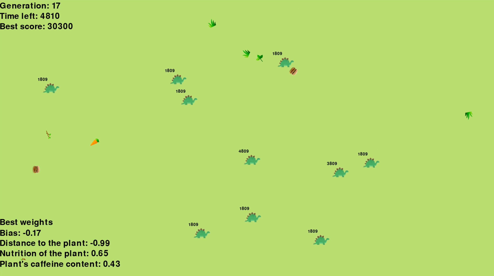

## Introduction
This script uses genetic algorithm with neural networks to evolve a generation of herbivores, to produce a generation that is the most fit in choosing the best types of food in order to survive.

## Screenshot

Images designed by Freepik from Flaticon.
